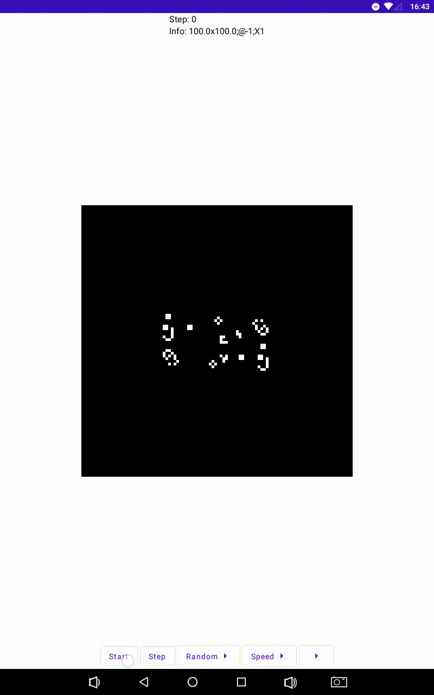
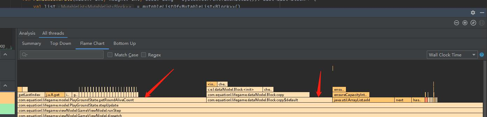

# 前言

> 康威生命游戏（英语：Conway's Game of Life），又称康威生命棋，是英国数学家约翰·何顿·康威在1970年发明的细胞自动机。 - 维基百科

不知道生命游戏是什么的，可以试试这个在线版生命游戏：[Game of Life](https://copy.sh/life/)

简单来说就是在每一回合按照一定的规则计算出所有坐标上的“细胞”下一回合应该处于存活还是死亡状态。

> 在游戏的进行中，杂乱无序的细胞会逐渐演化出各种精致、有形的结构；这些结构往往有很好的对称性，而且每一代都在变化形状。一些形状已经锁定，不会逐代变化。有时，一些已经成形的结构会因为一些无序细胞的“入侵”而被破坏。但是形状和秩序经常能从杂乱中产生出来。 - 维基百科

看到 compose 刚出来时就有很多大佬用它来实现了各种经典的小游戏：如 [俄罗斯方块](https://juejin.cn/post/6950196093367877663) 、 [Flappy Bird](https://juejin.cn/post/6989432341592539166) 。

那我心里也很痒痒啊，也想自己搞一个，但是我技术不够，复杂的游戏也搞不了，所以就参照各位大佬的代码，写了个简单的生命游戏。

由于生命游戏是一个 *零玩家游戏* ，所以我不需要处理玩家的交互，而且该游戏规则也很简单，实在是用来做入门的首选游戏。

demo 效果预览：



*由于录制成GIF有点丢帧，所以看起来可能会有点卡卡的感觉，实际运行很流畅*

# 代码实现

本次游戏的实现依然使用 MVI 架构，因为正如某大佬所说，compose 天生适合使用 MVI。

## 定义游戏状态和viewModel

### 游戏状态
正如上文所说，由于生命游戏是一个 *零玩家游戏* ，所以游戏状态也十分简单，无非就是 准备中（第一次进入游戏）、运行中（正在自动运行）、暂停中（用户暂停了游戏） 三种状态：

```kotlin
enum class GameState(val msg: String) {
    Wait("Start"),
    Running("Pause"),
    Pause("Resume"),
}
```

上面代码中的 `msg` 是控制按钮显示的文字。

除了游戏的整体运行状态外，我们还需要定义游戏中每一个细胞的状态，这里我将细胞命名为了 `Block`， 新建一个 data class 用来定义 Block 的属性和需要用到的方法：

```kotlin
data class Block(
    var State: BlockState,
) {
    fun getColor() = if (this.State.isAlive()) Color.White else Color.Black

    companion object {
        /**
         * 每个格子的大小
         * */
        const val SIZE = 5

    }
}
```

按照生命游戏规则，每个细胞仅有两种状态：存活或死亡，因此 Block 的属性很简单，只有一个 BlockState ：

```kotlin
enum class BlockState {
    ALIVE,
    DEAD;

    fun isAlive() = this == ALIVE
}
```

在 BlockState 枚举类中，我们定义 Block 的存活和死亡状态。

在 Block 中，我们写了一个方法 `getColor` 用来获取当前 Block 应该用什么颜色来显示，同时用伴生对象定义了每个 Block 格子的大小 `SIZE` 。

最后，我们还需要一个细胞所处环境的状态，这里我将这个状态命名为 PlayGroundState ：

```kotlin
data class PlayGroundState(
    val lifeList: List<List<Block>>
)
```

环境定义也十分简单，无非就是当前环境中每个细胞（Block）的状态，因此只有一个用二维 list 表示的 lifeList 属性。

其中 `lifeList[column][row]` ， 用 column 表示一行数据，用 row 表示一行中的列数据。

自此游戏所需要的所有状态已经定义完成，总的 viewState 如下：

```kotlin
data class ViewState(
    val gameState: GameState = GameState.Wait,
    val playGroundState: PlayGroundState = PlayGroundState(PlayGroundState.randomGenerate(1, 1))
)
```

由于 MVI 架构的单项数据流限制，每个 State 在初始化时必须有初始值，所以上述代码中给两个 State 都定义了初始值， `randomGenerate` 这个方法下面就会讲到。

### 游戏逻辑处理
首先我们来看一下生命游戏的规则（摘抄自维基百科）：

- 每个细胞有两种状态 - 存活或死亡，每个细胞与以自身为中心的周围八格细胞产生互动（如图，黑色为存活，白色为死亡）
- 当前细胞为存活状态时，当周围的存活细胞低于2个时（不包含2个），该细胞变成死亡状态。（模拟生命数量稀少）
- 当前细胞为存活状态时，当周围有2个或3个存活细胞时，该细胞保持原样。
- 当前细胞为存活状态时，当周围有超过3个存活细胞时，该细胞变成死亡状态。（模拟生命数量过多）
- 当前细胞为死亡状态时，当周围有3个存活细胞时，该细胞变成存活状态。（模拟繁殖）

由上述规则可知，无论是哪种情况，我们都需要先获取到当前位置的细胞周围的存活细胞数量，为了方便理解，我们写的稍微傻瓜一点：

```kotlin
private fun getRoundAliveCount(pos: Point): Int {
    var count = 0
    // 将当前细胞周围细胞按照下面序号编号
    //   y  y  y
    // x 0  1  2
    // x 3 pos 4
    // x 5  6  7

    // 查找 0 号
    if (pos.x > 0 && pos.y > 0 && lifeList[pos.y-1][pos.x-1].State.isAlive()) count++
    // 查找 1 号
    if (pos.y > 0 && lifeList[pos.y-1][pos.x].State.isAlive()) count++
    // 查找 2 号
    if (pos.x < lifeList[0].lastIndex && pos.y > 0 && lifeList[pos.y-1][pos.x+1].State.isAlive()) count++
    // 查找 3 号
    if (pos.x > 0 && lifeList[pos.y][pos.x-1].State.isAlive()) count++
    // 查找 4 号
    if (pos.x < lifeList[0].lastIndex && lifeList[pos.y][pos.x+1].State.isAlive()) count++
    // 查找 5 号
    if (pos.x > 0 && pos.y < lifeList.lastIndex && lifeList[pos.y+1][pos.x-1].State.isAlive()) count++
    // 查找 6 号
    if (pos.y < lifeList.lastIndex && lifeList[pos.y+1][pos.x].State.isAlive()) count++
    // 查找 7 号
    if (pos.x < lifeList[0].lastIndex && pos.y < lifeList.lastIndex && lifeList[pos.y+1][pos.x+1].State.isAlive()) count++

    return count
}
```

我们把当前细胞位置（pos）周围的细胞按照左上角为 0， 依次左到右，上到下编号，然后依次判断这些细胞是否存活。

需要注意的是我们需要判断周围细胞是否越界，例如 0 号细胞需要判断是否为第一行的细胞，避免 y 越界；还需判断 0 号是否为第一列的细胞，避免 x 越界。即，必须满足判断条件：`pos.x > 0 && pos.y > 0`

同理，对于 1 号而言，只需要判断 y 是否越界即可，因为它与目标细胞在同一列，无需判断 x 是否越界。

获取到周围细胞存活数量后，按照规则更改当前细胞状态即可：

```kotlin
/**
 * 更新一步状态
 * */
fun stepUpdate(): List<List<Block>> {
    // 深度复制，不然无法 recompose
    val newLifeList: MutableList<List<Block>> = mutableListOf()
    lifeList.forEach { lineList ->
        newLifeList.add(lineList.map { it.copy() })
    }

    newLifeList.forEachIndexed { columnIndex, lineList ->
        lineList.forEachIndexed { rowIndex, block ->
            val aroundAliveCount = getRoundAliveCount(Point(rowIndex, columnIndex))
            if (block.State.isAlive()) { // 当前细胞存活
                if (aroundAliveCount < 2) block.State = BlockState.DEAD
                if (aroundAliveCount > 3) block.State = BlockState.DEAD
            }
            else { // 当前细胞死亡
                if (aroundAliveCount == 3) block.State = BlockState.ALIVE
            }
        }
    }

    return newLifeList
}
```

更新细胞状态时有一个容易踩坑的地方，就是关于当前 lifeList 的更改。

我们肯定不能直接修改 lifeList 的值，因为这样会导致判断周围细胞数量出错，而且由于没有使用 `mutableStateListOf` 而是使用的统一的 viewState 管理状态，compose 是无法感知到列表内容的变化从而触发 recompose 的。

那么我们新建一个 `newLifeList: MutableList<List<Block>> = mutableListOf()` 然后 `newLifeList.addAll(lifeList)` 呢？感兴趣的可以试试，我这里可以先告诉你，这样也不行。

因为虽然我们新建了一个 newLifeList 对象，但是使用 `addAll` 添加的元素是浅拷贝，简单来说就是虽然这是一个新的 list 对象，但是添加到其中的元素并不是重新开辟了一块新内存来存的，而是直接把 `lifeList` 中的元素地址复制给了 `newLifeList` 。

而由于 kotlin 的对象是否相等的特性或者说 compose 判断是否需要 recompose 的原理，这样并不能触发 recompose 。

我们需要的是克隆或者说深度复制：

```kotlin
val newLifeList: MutableList<List<Block>> = mutableListOf()
lifeList.forEach { lineList ->
    newLifeList.add(lineList.map { it.copy() })
}
```

搞定了游戏的运行逻辑，下一步是如何生成初始状态，我们这里暂时只写一个随机生成初始状态的函数：

```kotlin
fun randomGenerate(width: Int, height: Int, seed: Long = System.currentTimeMillis()): List<List<Block>> {
    val list = mutableListOf<MutableList<Block>>()
    val random = Random(seed)

    for (h in 0 until height) {
        val lineList = mutableListOf<Block>()
        for (w in 0 until width) {
            lineList.add(Block(if (random.nextBoolean()) BlockState.ALIVE else BlockState.DEAD))
        }
        list.add(lineList)
    }

    return list
}
```

上面的函数接收三个参数，width、height、seed，分别表示需要生成的游戏界面大小（width、height），即列表中的 row、column；

而 seed 表示生成随机状态的种子，添加这个参数是为了后期扩展支持自定义种子，同时为了调试时确保能生成相同的初始状态。

### viewModel
通过上面对游戏逻辑的介绍，我们不难想到，对于交互控制也就 开始/暂停、步进、随机生成 三个，所以我们编写的 Action 如下：

```kotlin
sealed class GameAction {
    object RunStep: GameAction()
    object ToggleGameState: GameAction()
    data class RandomGenerate(val width: Int, val height: Int, val seed: Long): GameAction()
}
```

为了确保数据的单向流动，我们的状态必须设置为 `private set` 仅允许读取，如果要更改状态只能通过 `dispatch` 方法更改：

```kotlin
var viewStates by mutableStateOf(ViewState())
    private set

fun dispatch(action: GameAction) {
    when (action) {
        is GameAction.RunStep -> runStep()
        is GameAction.ToggleGameState -> toggleGameState()
        is GameAction.RandomGenerate -> randomGenerate(action.width, action.height, action.seed)
    }
}
```

更改状态也很简单，重新创建 `viewStates` 对象即可，为了方便，不用每次都设置所有状态，同时为了保留不需要更改的状态，这里我们使用 `copy` 方法，以 `runStep()` 为例：

```kotlin
private fun runStep() {
    val newList = viewStates.playGroundState.stepUpdate()
    viewStates = viewStates.copy(playGroundState = PlayGroundState(newList))
}
```

## 实现生命游戏的界面

### 直接使用 composable

我们来分析一下生命游戏的界面：


*图片来自 维基百科*

无非就是一堆格子，填充不同的颜色罢了，所以很容易想到，那直接用 Column + Row 组合配合不同背景颜色不就行了吗？

所以我们很容易写出代码如下：

```kotlin
@Composable
fun PlayGround(blockList: List<List<Block>>) {
    Column(
        Modifier
            .size((blockList[0].size * Block.SIZE).dp, (blockList.size * Block.SIZE).dp)
            .background(Color.Black)) {
        blockList.forEach { lineList ->
            Row {
                lineList.forEach { block ->
                    Row(modifier = Modifier
                        .size(Block.SIZE.dp)
                        .background(block.getColor())) {}
                }
            }
        }
    }
}
```

上述代码很简单，就是遍历格子状态列表，从格子状态中拿到当前格子的颜色，然后生成 ROW ，其中 `Block.SIZE` 是我定义的一个常量，用来表示一个格子的大小。

预览一下效果，好像也不错：

```kotlin
@Preview(showSystemUi = true)
@Composable
fun PLayGroundPreview() {
    val playGroundState = PlayGroundState(PlayGroundState.randomGenerate(70, 90, 1))
    PlayGround(playGroundState)
}
```


但是当我们装到真机上运行时，却发现随机生成一个 70*90 的方格也会非常的慢，尝试点一下步进，也会卡顿很久才刷新完成，连步进都这么卡，更遑论自动播放了，自动播放至少也得每秒更新24次才会看起来不卡吧？

其实仔细一想，直接这样实现确实不妥，毕竟 70*90 的大小，意味着需要生成 6300 个 Row 对象，不卡就奇怪了，而且按照 compose 的特性，所有 composable 都随时可能会 recompose ，这么多 composable 卡顿是必然的。

那么怎么办呢？

很简单，我们用自定义 view 直接画一个完整的游戏界面，让它每次 recompose 时只重组一个对象不就行了？

### 使用自定义 “view”

在 compose 中同样可以使用自定义 “view” ，注意此处我给 view 打上引号是因为在 compose 中没有 view 这个概念，所有 ui 都叫 composable 。

在这里我们需要用到一个叫 `Canvas` 的 composable ，它的定义如下：

```kotlin
public fun Canvas(
    modifier: Modifier,
    onDraw: DrawScope.() -> Unit
): Unit
```

按照这个定义，我们需要给它一个 modifier 指定该 composeable 的大小，就可以在 `onDraw` 中写入我们的自定义 UI。

而实现我们的需求，很显然需要绘制矩形，因此，我们应该使用 `drawRect`，代码如下：

```kotlin
@Composable
fun PlayGround(playGroundState: PlayGroundState) {
    val blockList: List<List<Block>> = playGroundState.lifeList
    Canvas(modifier = Modifier
        .size((blockList[0].size * Block.SIZE).dp, (blockList.size * Block.SIZE).dp)
        .background(Color.Black)
    ) {
        blockList.forEachIndexed { Column, lineList ->
            lineList.forEachIndexed { row, block ->
                if (block.State.isAlive()) {
                    drawRect(color = block.getColor(),
                        topLeft = Offset(row*Block.SIZE.dp.toPx(), Column*Block.SIZE.dp.toPx()),
                        size = Size(Block.SIZE.dp.toPx(), Block.SIZE.dp.toPx()))
                }
            }
        }
    }
}
```

这段代码和直接使用 composable 差不多，只有几点需要注意一下。

第一个需要注意的是在绘制矩形时，需要按照当前索引位置和格子尺寸偏移绘制时的起始位置，即：`topLeft = Offset(row*Block.SIZE.toDp().toPx(), Column*Block.SIZE.toDp().toPx())`，
这里定义的是矩形的左上角的坐标

第二个需要注意的时，在 `Canvas` 中使用的单位都是 px ，所以涉及到单位的地方都需要换算一下，例如：`Block.SIZE.dp.toPx()`

测试一下，发现卡顿确实是消失了，但是总觉得好像上面代码有点奇怪？

对了，由于采用了 `Canvas` 而不是直接用的 composable ，所以其实不用绘制每一个方格，只需要把背景颜色改为死亡时的颜色，然后只绘制存活方格就可以了，改一下上面的绘制部分代码为：

```kotlin
if (block.State.isAlive()) {
    drawRect(color = block.getColor(),
        topLeft = Offset(row*Block.SIZE.toDp().toPx(), Column*Block.SIZE.toDp().toPx()),
        size = Size(Block.SIZE.toDp().toPx(), Block.SIZE.toDp().toPx()))   
}
```

## 如何自动运行
实现自动运行需要用到协程，不然会阻塞线程，在 compose 中，已经为我们自带了协程的上下文 `LaunchedEffect` ，我们直接使用即可。

在最顶层添加一段代码：

```kotlin
LaunchedEffect(key1 = "game looper") {
    while (isActive) {
        if (viewModel.viewStates.gameState == GameState.Running) {
            viewModel.dispatch(GameAction.RunStep)
        }
        delay(AutoRunningDuration)
    }
}
```

在上面的代码中，我们循环读取 `gameState` 的值，如果该值被更改为运行状态（Running），则调用一次步进，以此达到自动运行的目的，我们还可以通过设置 `delay` 的值来控制游戏速度。

`viewModel` 可以通过 lifeCycle 的 compose 库直接获得：`val viewModel: GameViewModel = viewModel()`

最后，经过亿点点的小优化和细节调整，APP完成！

## 导入预设
在导入预设之前，我们需要先找到一些预设。

在 [Life Lexicon Home Page](https://conwaylife.com/ref/lexicon/lex_home.htm) 这个网站上，我找到一些有意思的预设种子，我们将其下载下来。

发现它的数据格式形如：

```
.**....................................
.**.................*..................
...................*.*............*.*..
....................*............*.....
**.......**.......................*..*.
**.*.....**.......................*.*.*
...*.......................*.......*..*
...*.......................**.......**.
*..*.................**.....*..........
.**..................*.................
.....................***...............
....................................**.
....................................**.
.**....................................
*..*...................................
*.*.*................*.*....**.....**..
.*..*.................**....**.....**.*
.....*............*...*...............*
..*.*............*.*..................*
..................*................*..*
....................................**.
```

一眼就能看出来，其中的 `.` 表示死亡细胞， `*` 表示存活细胞。

我们将这些数据存入一个文本文件 `sample.txt` ， 并将其移至项目的 raw 文件夹。

然后解析这个数据：

```kotlin
val sourceString = context.resources.openRawResource(R.raw.sample).bufferedReader().use { it.readText() }
val lifeList: MutableList<MutableList<Block>> = mutableListOf()

sourceString.lines().forEach { string ->
    val line = mutableListOf<Block>()
    string.forEach { char ->
        if (char == '.') line.add(Block(BlockState.DEAD))
        if (char == '*') line.add(Block(BlockState.ALIVE))
    }
    lifeList.add(line)
}
```

最后将解析出来的 lifeList 重新更新至 viewStates 即可。

不知道各位读者有没有看出来，这个预设其实就是我的截图中使用的预设，官方的介绍如下：

> The following p104 double-barrelled glider gun. It uses a B-heptomino and emits one glider every 52 generations. It was found by Noam Elkies in March 1996, except that Elkies used blockers instead of molds, the improvement being found by David Bell later the same month.

各位增加运行速度就可以看出，它每隔一段时间就会从上方或下方斜射出一个 “滑翔机”。

# 后续优化

可以看到现在只是一个非常简陋的 demo ，因此后续计划是对它进行亿点点简单的优化，让它更加完善。

后续将会在 GitHub 持续更新，欢迎 star：

[life-game-compose](https://github.com/equationl/life-game-compose) 、 [国内镜像仓库](https://gitee.com/equation/life-game-compose)

# 更新记录
## 优化计算速度

*提示：为了方便说明问题，下面的速度测试均是在一个超级低端机（RK3288处理器，2GB DDR3运行内存）上进行的，所以耗时是正常手机的数十倍，例如，该低端设备在优化前耗时 20+ms，但是在正常手机上耗时只有个位数。*

开始之前我们先来测试一下目前计算一个 100x100 的格子一轮需要耗时多久，在步进更新代码处(runStep)添加如下代码：

```kotlin
val startTime = System.currentTimeMillis()
val newList = viewStates.playGroundState.stepUpdate()
Log.i(TAG, "runStep: step duration: ${System.currentTimeMillis() - startTime} ms")
```

编译运行，输出如下：

```
runStep: step duration: 24 ms
runStep: step duration: 23 ms
runStep: step duration: 25 ms
runStep: step duration: 23 ms
runStep: step duration: 24 ms
runStep: step duration: 23 ms
runStep: step duration: 27 ms
runStep: step duration: 26 ms
runStep: step duration: 24 ms
runStep: step duration: 23 ms
runStep: step duration: 24 ms
runStep: step duration: 23 ms
runStep: step duration: 22 ms
runStep: step duration: 24 ms
runStep: step duration: 22 ms
runStep: step duration: 23 ms
runStep: step duration: 24 ms
```

可以看到，更新一轮大约需要 20-25 ms，这还仅仅只是计算新的状态，不包括绘制的时间，如果再加上绘制时间，这个耗时将变得难以接受。

打开 AndroidStudio 的 ProFiler 录制进程信息，查看单次步进计算时都是哪些方法“拖了后腿”：



可以看出，耗时方法主要是 `getRoundAliveCount` 和 `copy` 。很好！找到元凶了……吗？

其实不然，这只是假象，真正耗时的其实并不是他俩，不明白？我们再来回顾一下他俩出现的地方：


发现了吗？没错，它俩都是在循环当中。

也就是说，虽然它俩确实比较耗时，但是也没有离谱到会被计算速度拉低到几十 ms 的地步，罪魁祸首是因为他们在循环之中，于是他们的耗时随着循环次数增加也在被不断的累积。

那么，应该怎么去优化呢？

首先看看 `getRoundAliveCount` 放大这个方法的耗时情况，可以看到它的耗时大多数是被取各种属性累计起来了：


这个咱们确实可以优化，比如，对于 `lastIndex` 属性，这个值是固定不变的，不用每次遍历都去取一次， 还有 `ArrayList.get()` 其实这个方法有很多重复调用的地方，也可以优化一下，用空间换时间。而对于其他的耗时，诸如 `Block.isAlive` 、 `Block.State` 这个无法更改。

那么我们再来看看 `copy` 是什么情况，这个都不用看图了，一想就知道，每次遍历 copy 时都会创建一个新的 Block 对象，耗时自然会居高不下。

那么应该怎么优化呢？

还记得我们前面说过的吗？细胞的状态有且仅有存活和死亡两种情况，也就是说，这里用 data class 嵌套 enum class 实属多余，只会徒增运行成本，此处其实可以直接使用 Int 或 Boolean 这种基本数据类型来储存。

这样做还有一个好处，那就是上面说到的取 Block 属性的耗时也可以同样的优化掉。

再更改一下判断条件，尽可能的减少判断次数，并且按照上面思路减少对象的创建，修改后代码如下：

```kotlin
    /**
 * 更新一步状态
 * */
fun stepUpdate(): MutableList<MutableList<Int>> {
    // 深度复制，不然无法 recompose
    val newLifeList: MutableList<MutableList<Int>> = mutableListOf()
    lifeList.forEach { lineList ->
        newLifeList.add(lineList.map { it }.toMutableList())
    }

    val columnLastIndex = newLifeList.size - 1
    val rowLastIndex = newLifeList[0].size - 1

    newLifeList.forEachIndexed { columnIndex, lineList ->
        lineList.forEachIndexed { rowIndex, block ->
            val aroundAliveCount = getRoundAliveCount(rowIndex, columnIndex, columnLastIndex, rowLastIndex)
            if (block.isAlive()) { // 当前细胞存活
                if (aroundAliveCount < 2) newLifeList[columnIndex][rowIndex] = Block.DEAD
                if (aroundAliveCount > 3) newLifeList[columnIndex][rowIndex] = Block.DEAD
            }
            else { // 当前细胞死亡
                if (aroundAliveCount == 3) newLifeList[columnIndex][rowIndex] = Block.ALIVE
            }
        }
    }

    return newLifeList
}

private fun getRoundAliveCount(posX: Int, posY: Int, columnLastIndex: Int, rowLastIndex: Int): Int {
    var count = 0
    // 将当前细胞周围细胞按照下面序号编号
    //   y  y  y
    // x 0  1  2
    // x 3 pos 4
    // x 5  6  7

    if (posY > 0) {
        val topLine = lifeList[posY-1]

        // 查找 0 号
        if (posX > 0 && topLine[posX-1].isAlive()) count++
        // 查找 1 号
        if (topLine[posX].isAlive()) count++
        // 查找 2 号
        if (posX < rowLastIndex && topLine[posX+1].isAlive()) count++
    }

    if (posY < columnLastIndex) {
        val bottomLine = lifeList[posY+1]

        // 查找 5 号
        if (posX > 0 && bottomLine[posX-1].isAlive()) count++
        // 查找 6 号
        if ( bottomLine[posX].isAlive()) count++
        // 查找 7 号
        if (posX < rowLastIndex && bottomLine[posX+1].isAlive()) count++
    }

    val currentLine = lifeList[posY]
    // 查找 3 号
    if (posX > 0 && currentLine[posX-1].isAlive()) count++
    // 查找 4 号
    if (posX < rowLastIndex && currentLine[posX+1].isAlive()) count++


    return count
}
```

上面定义了两个常量和一个扩展函数：

```kotlin
const val DEAD = 0
const val ALIVE = 1

fun Int.isAlive() = this == ALIVE
```

同样运行 100x100 的格子耗时如下：

```
step duration: 10 ms
step duration: 9 ms
step duration: 9 ms
step duration: 9 ms
step duration: 10 ms
step duration: 9 ms
step duration: 9 ms
step duration: 10 ms
step duration: 10 ms
step duration: 9 ms
step duration: 9 ms
step duration: 9 ms
step duration: 9 ms
step duration: 9 ms
step duration: 10 ms
step duration: 9 ms
step duration: 9 ms
```

耗时成功被控制在了 10ms 左右！

但是还是觉得不太满意，那么怎么办呢？之所以这么耗时是因为遍历了两次，一次用来复制数组，一次用来计算，总觉得复制数组这段时间好浪费啊，能不能干掉呢？

欸，还真的能，还记得吗？我们之所以要深度复制数组，一来是因为不复制无法触发 recompose ，二来是因为如果直接改原数组会造成计算错误。

由于我们现在已经把数组储存数据从对象改成了基本数据类型，所以不存在无法 recompose 的情况了。

那么，第二条怎么解决呢？也很简单，我们不是把数据类型改为了 Int 嘛？

0 表示死亡；1 表示存活，那我们再多加几个状态不就得了？用 3 表示 从存活变成死亡，4 表示从死亡复活。

然后在下一轮计算时顺手改回 0 或者 1，不就行了？

说干就干，增加两个状态：

```kotlin
const val ALIVE_TO_DEAD = 3
const val DEAD_TO_ALIVE = 4

fun Int.isAlive() = (this == ALIVE || ALIVE_TO_DEAD)
```

然后去掉复制数组的代码，直接操作原数组。

看一下耗时，因为其实复制数组耗时非常小，所以改成 500x500 的格子来测试，这是去掉复制数组前的耗时：

```
runStep: step duration: 471 ms
runStep: step duration: 432 ms
runStep: step duration: 447 ms
runStep: step duration: 432 ms
runStep: step duration: 428 ms
runStep: step duration: 426 ms
runStep: step duration: 435 ms
runStep: step duration: 436 ms
runStep: step duration: 438 ms
runStep: step duration: 424 ms
runStep: step duration: 436 ms
runStep: step duration: 427 ms
runStep: step duration: 434 ms
```

这是去除复制后的耗时：

```
runStep: step duration: 528 ms
runStep: step duration: 531 ms
runStep: step duration: 521 ms
runStep: step duration: 522 ms
runStep: step duration: 521 ms
runStep: step duration: 521 ms
runStep: step duration: 524 ms
runStep: step duration: 520 ms
runStep: step duration: 518 ms
runStep: step duration: 518 ms
runStep: step duration: 517 ms
runStep: step duration: 517 ms
runStep: step duration: 522 ms
runStep: step duration: 521 ms
runStep: step duration: 520 ms
runStep: step duration: 515 ms
```

怎么回事？？？反而耗时更大了？

显然，由于增加了额外的两个状态，在设置和读取状态时的耗时远远超过了直接复制数组的耗时，得不偿失，还是继续老老实实复制吧。

这里已经无法优化了，但是还是觉得这个耗时无法接受怎么办？有没有办法让速度更快一点？

看来看去，最终的着手点似乎都落在了减少遍历次数上，可是减少遍历次数说着简单，真实践起来太困难了，以我的技术水平目前无法做到……

那怎么办呢？

在B大佬的提醒下，我恍然大悟，或许可以使用 C/C++ 来实现这部分的计算，众所周知 C/C++ 的运行速度可比 Jvm 快多了。


## TODO LIST

|            TODO            | 状态 | 备注 |
| -------------------------- | ---- | ------ |
| 优化界面，至少不要像现在这样单调 |  ⬜  | 无   |
| 可设置随机生成的种子           |  ✅  | 无   |
| 可设置随机游戏界面的尺寸        |  ✅  | 无   |
| 可设置自动运行时的速度          |  ✅  | 无   |
| 可以导出当前画布截图            |  ⬜  | 无   |
| 可以导入自定义的初始状态         |  ⬜  | 也可以是程序预设一些好看的初始状态 |
| 支持无限画布大小                |  ⬜  | 这个有点难度了 |
| 支持自定义初始状态              |  ⬜  | 这个有点难度了 |
| 支持跨平台运行                  |  ⬜  | 无 |